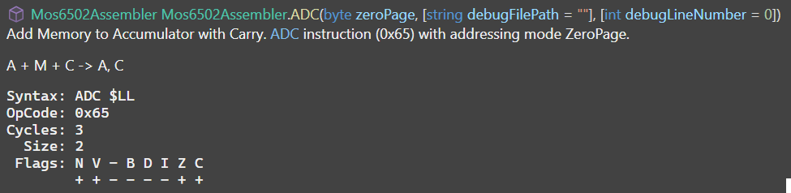

# Asm6502 [](https://github.com/xoofx/Asm6502/actions/workflows/ci.yml) [](https://www.nuget.org/packages/Asm6502/)


Asm6502 is a lightweight and efficient C# library to assemble and disassemble 6502/6510 assembly code. It provides a fluent API to create 6502/6510 assembly code (e.g. a CPU powering the Commodore 64), and can be used to generate binary files or disassemble existing binaries into assembly code.

## ✨ Features

- **Full support** for all core 6502 instructions and 6510 instructions (6502 + illegal opcodes)
- Unique **strongly typed** and fluent assembler API
- Support producing **debug information** (C# file and line numbers) for each instruction
- **Easily disassemble** instructions and operand.
- **High performance** / **zero allocation** library for disassembling / assembling instructions.
- Compatible with `net8.0+` and NativeAOT.
- Integrated assembler API documentation via API XML comments.
  

## 📖 User Guide

For more details on how to use Asm6502, please visit the [user guide](https://github.com/xoofx/Asm6502/blob/main/doc/readme.md).

Suppose that we want to write a simple program in C# to assemble and disassemble the equivalent of the following 6502 assembly code:

```
        .org $c000             ; Start address (for example, on C64 this is an available memory area)

        ; Initialization
START:  LDX #$00               ; X = 0, index into buffer
        LDY #$10               ; Y = 16, number of bytes to process

LOOP:   LDA $0200,X            ; Load byte at $0200 + X
        CMP #$FF               ; Check if byte is already 0xFF
        BEQ SKIP               ; If so, skip incrementing

        CLC                    ; Clear carry before addition
        ADC #$01               ; Add 1
        STA $0200,X            ; Store result back to memory

SKIP:   INX                    ; X = X + 1
        DEY                    ; Y = Y - 1
        BNE LOOP               ; Loop until Y == 0

        ; Call subroutine to flash border color
        JSR FLASH_BORDER

        ; Infinite loop
END:    JMP END

; ------------------------------
; Subroutine: FLASH_BORDER
; Cycles border color between 0–7
; (Useful on C64, otherwise dummy)
; ------------------------------
FLASH_BORDER:
        LDX #$00

FLASH_LOOP:
        STX $D020              ; C64 border color register
        INX
        CPX #$08
        BNE FLASH_LOOP

        RTS
```

The following C# assembly would assemble this code using the `Asm6502` library:
```csharp
using var asm = new Mos6502Assembler();

asm
    .Begin(0xc000)
    .Label(out var start)
    .LDX_Imm(0x00)             // X = 0, index into buffer
    .LDY_Imm(0x10)             // Y = 16, number of bytes to process

    .Label(out var loop)
    .LDA(0x0200, X) // Load byte at $0200 + X
    .CMP_Imm(0xFF)             // Check if byte is already 0xFF

    .BEQ(out var skip)        // If so, skip incrementing (forward label)
    .CLC()                 // Clear carry before addition
    .ADC_Imm(0x01)             // Add 1
    .STA(0x0200, X) // Store result back to memory

    .Label(skip)      // X = X + 1
    .INX()
    .DEY()                 // Y = Y - 1
    .BNE(loop)        // Loop until Y == 0

    // Call subroutine to flash border color
    .JSR(out var flash_border) // Declare a forward label

    // Infinite loop
    .Label(out var end)
    .JMP(end)

    // ------------------------------
    // Subroutine: FLASH_BORDER
    // Cycles border color between 0–7
    // (Useful on C64, otherwise dummy)
    // -----------------------------
    .Label(flash_border)
    .LDX_Imm(0x00)

    .Label(out var flash_loop)
    .STX(0xD020) // C64 border color register
    .INX()
    .CPX_Imm(0x08)
    .BNE(flash_loop)
    .RTS()

    .End();                 // Mark the end of the assembly (to resolve labels)

var buffer = asm.Buffer; // Get the assembled buffer
```

Disassembling the same code can be done using the `Mos6502Disassembler` class:
```csharp
var dis = new Mos6502Disassembler(new Mos6502DisassemblerOptions()
{
    PrintLabelBeforeFirstInstruction = false,
    PrintAddress = true,
    PrintAssemblyBytes = true,
});

var asmText = dis.Disassemble(asm.Buffer);
Console.WriteLine(asmText);
```

Will generate the following disassembled code:

```
C000  A2 00      LDX #$00
C002  A0 10      LDY #$10

LL_02:
C004  BD 00 02   LDA $0200,X
C007  C9 FF      CMP #$FF
C009  F0 06      BEQ LL_01

C00B  18         CLC
C00C  69 01      ADC #$01
C00E  9D 00 02   STA $0200,X

LL_01:
C011  E8         INX
C012  88         DEY
C013  D0 EF      BNE LL_02

C015  20 1B C0   JSR LL_03

LL_04:
C018  4C 18 C0   JMP LL_04

LL_03:
C01B  A2 00      LDX #$00

LL_05:
C01D  8E 20 D0   STX $D020
C020  E8         INX
C021  E0 08      CPX #$08
C023  D0 F8      BNE LL_05

C025  60         RTS
```

## 🪪 License

This software is released under the [BSD-2-Clause license](https://opensource.org/licenses/BSD-2-Clause). 

## 🌟 Credits

Thanks to Norbert Landsteiner for providing the [6502 Instruction Set](https://www.masswerk.at/6502/6502_instruction_set.html).

## 🤗 Author

Alexandre Mutel aka [xoofx](https://xoofx.github.io).
